# AI_MindVault - 医疗健康智能问诊助手

基于 LangChain4j + RAG 的医疗健康智能问诊系统，AI 顾问 **A.R.I.A**（Advanced Responsive Intelligent Advisor）提供专业、通俗的健康咨询服务，支持流式输出、会话管理、知识库检索、预约挂号、社区问诊等功能。

## 系统架构

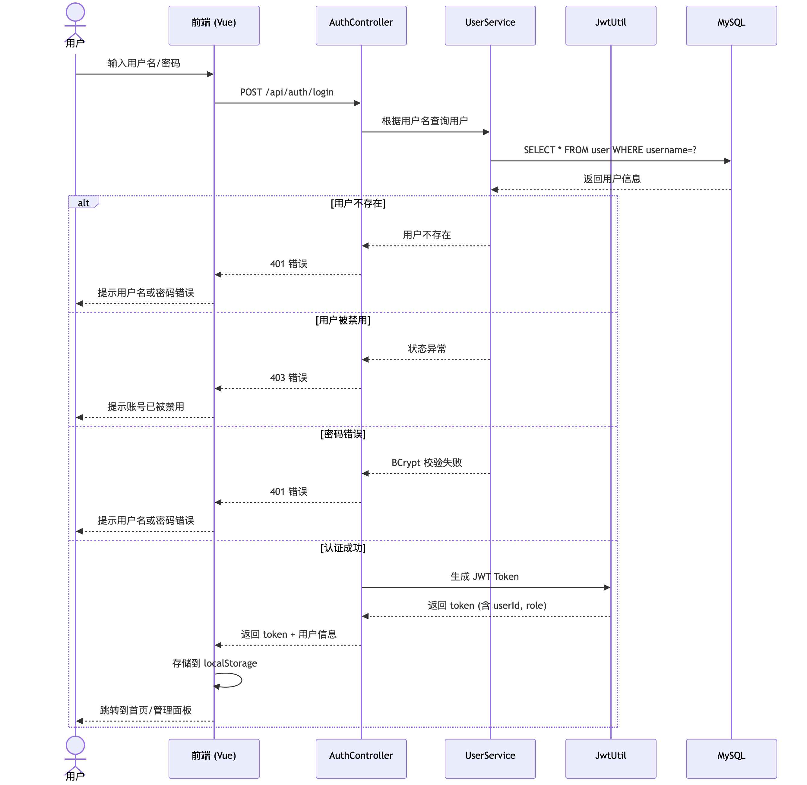

> 更多架构图与流程图见下方 [📄 架构与流程图](#架构与流程图) 章节。

## 功能概览

### 用户端

| 功能 | 说明 |
|------|------|
| 💬 AI 智能问诊 | 与 A.R.I.A 实时对话，支持流式输出，逐字显示回复 |
| 💊 用药咨询 | 药品信息查询、药物联用风险检测、特殊人群用药提示、用药应急处理 |
| 🦠 疾病科普 | 疾病知识科普、相似病症鉴别、健康谣言辟谣 |
| 🔍 症状自查 | 多部位症状分析、多维度信息采集、风险分级判断（绿/黄/红） |
| 📋 健康档案 | 个人健康档案管理、日常健康数据记录（血压/血糖/步数/睡眠） |
| 📊 体检报告 | 上传体检报告，AI 自动解读分析 |
| 🏥 预约挂号 | 按科室预约，选择医生和时间 |
| 💬 社区问诊 | 发布健康问题，医生在线回复 |
| 📁 慢病管理 | 慢性病专项档案（糖尿病/高血压/痛风等），指标趋势追踪 |

### 管理端

| 功能 | 说明 |
|------|------|
| 📊 数据面板 | 用户统计、问诊量、预约量等数据概览 |
| 👥 用户管理 | 查看/编辑/禁用用户账号 |
| 🏥 科室管理 | 增删改查科室信息 |
| 💬 问诊处理 | 查看待回复的社区问诊帖子，医生在线回复 |
| 📅 预约管理 | 查看/确认/取消/完成预约记录 |

## 技术栈

| 层级 | 技术 |
|------|------|
| 后端框架 | Spring Boot 3.5.12 + Java 21 |
| AI 框架 | LangChain4j 1.0.1-beta6 |
| ORM | MyBatis-Plus 3.5.7 |
| 数据库 | MySQL 8.0+ |
| 缓存/向量库 | Redis Stack（支持向量存储） |
| 认证 | Spring Security + JWT |
| 流式传输 | WebSocket + WebFlux (Flux\<String\>) |
| 前端框架 | Vue 3 (Composition API) + Vite 8 |
| 状态管理 | Pinia |
| 路由 | Vue Router 4 |
| HTTP 客户端 | Axios |
| 可视化 | Chart.js + Three.js |

## 环境要求

运行本项目前，请确保已安装以下软件：

| 软件 | 版本要求 | 说明 |
|------|----------|------|
| **JDK** | 21+ | 后端运行环境 |
| **Maven** | 3.8+ | 后端构建工具 |
| **Node.js** | 18+ | 前端运行环境 |
| **npm** | 9+ | 前端包管理 |
| **MySQL** | 8.0+ | 主数据库 |
| **Redis Stack** | 7.0+ | 向量存储 + 缓存（需支持 RediSearch 模块） |

> ⚠️ **注意**：必须使用 **Redis Stack**（而非普通 Redis），因为 RAG 知识库检索依赖 Redis 的向量搜索能力（RediSearch 模块）。  
> Docker 快速启动 Redis Stack：`docker run -d --name redis-stack -p 6379:6379 redis/redis-stack:latest`

## 快速开始

### 第一步：克隆项目

```bash
git clone <your-repo-url>
cd AI_MindVault
```

### 第二步：配置后端

```bash
cd major_ai/src/main/resources
cp application.yml.example application.yml
```

编辑 `application.yml`，填入以下配置：

```yaml
spring:
  datasource:
    url: jdbc:mysql://localhost:3306/ai_mindvault?useSSL=false&serverTimezone=Asia/Shanghai&allowPublicKeyRetrieval=true
    username: root              # 改为你的 MySQL 用户名
    password: your_password     # 改为你的 MySQL 密码

langchain4j:
  open-ai:
    chat-model:
      api-key: your_api_key     # 改为你的 AI 模型 API Key
    streaming-chat-model:
      api-key: your_api_key     # 同上
    embedding-model:
      api-key: your_api_key     # 同上
  community:
    redis:
      host: localhost            # Redis 地址
      port: 6379                 # Redis 端口
      password:                  # Redis 密码（无密码留空）
```

### 第三步：初始化数据库

```bash
# 登录 MySQL 创建数据库
mysql -u root -p

# 在 MySQL 命令行中执行：
CREATE DATABASE ai_mindvault DEFAULT CHARACTER SET utf8mb4;
EXIT;
```

```bash
# 导入表结构和初始数据
cd major_ai
mysql -u root -p ai_mindvault < src/main/resources/schema.sql
```

初始数据包含：
- 10 个预设科室（消化内科、心血管科、神经内科、皮肤科、骨科、呼吸内科、内分泌科、儿科、妇产科、泌尿外科）
- 1 个管理员账号：用户名 `admin`，密码 `admin123`

### 第四步：启动后端

```bash
cd major_ai
mvn spring-boot:run
```

后端启动成功后运行在 `http://localhost:8080`。

### 第五步：启动前端

```bash
cd ai-frontend
npm install
npm run dev
```

前端启动成功后访问 `http://localhost:5173`。

### 第六步：登录使用

- 打开浏览器访问 `http://localhost:5173`
- 使用管理员账号登录：`admin` / `admin123`
- 或注册新用户账号

## API Key 配置指南

本项目通过 LangChain4j 的 OpenAI 兼容接口对接大模型，默认使用阿里云 **通义千问（DashScope）**。

### 获取通义千问 API Key

1. 访问 [阿里云 DashScope 控制台](https://dashscope.console.aliyun.com/)
2. 注册/登录阿里云账号
3. 开通 DashScope 服务
4. 在「API-KEY 管理」中创建 API Key
5. 将 Key 填入 `application.yml` 的 `api-key` 字段

### 使用环境变量（推荐）

也可以通过环境变量配置，避免将 Key 写入配置文件：

```bash
export QWEN_API_KEY=sk-xxxxxxxxxxxxxxxx
export MYSQL_PASSWORD=your_password
export REDIS_HOST=localhost
```

`application.yml` 已内置环境变量占位符 `${QWEN_API_KEY:your_api_key}`，设置了环境变量后无需修改配置文件。

## 切换 AI 模型

本项目支持任何 **OpenAI 兼容 API** 的模型。修改 `application.yml` 中三处 `base-url` 和 `model-name` 即可：

### 通义千问（默认）

```yaml
base-url: https://dashscope.aliyuncs.com/compatible-mode/v1
model-name: qwen-plus
```

### DeepSeek

```yaml
base-url: https://api.deepseek.com/v1
model-name: deepseek-chat
api-key: your_deepseek_api_key
```

### OpenAI

```yaml
base-url: https://api.openai.com/v1
model-name: gpt-4o
api-key: your_openai_api_key
```

### 本地 Ollama

```yaml
base-url: http://localhost:11434/v1
model-name: qwen2.5
api-key: ollama  # Ollama 不需要真实 Key，但字段不能为空
```

### 智谱 GLM

```yaml
base-url: https://open.bigmodel.cn/api/paas/v4
model-name: glm-4
api-key: your_zhipu_api_key
```

> 💡 **提示**：切换模型时，`chat-model`、`streaming-chat-model`、`embedding-model` 三处都需要修改。其中 `embedding-model` 用于 RAG 知识库的文本向量化，如果新模型不支持 embedding，可保留通义千问的 `text-embedding-v4` 作为 embedding-model。

## 环境变量参考

| 变量名 | 说明 | 默认值 |
|--------|------|--------|
| `QWEN_API_KEY` | AI 模型 API Key | `your_api_key` |
| `MYSQL_HOST` | MySQL 主机地址 | `localhost` |
| `MYSQL_PORT` | MySQL 端口 | `3306` |
| `MYSQL_DATABASE` | 数据库名 | `ai_mindvault` |
| `MYSQL_USERNAME` | MySQL 用户名 | `root` |
| `MYSQL_PASSWORD` | MySQL 密码 | `your_password` |
| `REDIS_HOST` | Redis 主机地址 | `localhost` |
| `REDIS_PORT` | Redis 端口 | `6379` |
| `REDIS_PASSWORD` | Redis 密码 | 空 |

## 项目结构

```
AI_MindVault/
├── major_ai/                          # 后端 Spring Boot 项目
│   ├── pom.xml                        # Maven 依赖配置
│   └── src/main/
│       ├── java/org/example/major_ai/
│       │   ├── MajorAiApplication.java    # 启动类
│       │   ├── aiservice/                 # LangChain4j AI 服务接口
│       │   ├── config/                    # 配置类（RAG、WebSocket、Security）
│       │   ├── controller/                # REST 接口
│       │   ├── handler/                   # WebSocket 消息处理器
│       │   ├── security/                  # JWT 认证、安全配置
│       │   ├── entity/                    # 数据库实体类
│       │   ├── mapper/                    # MyBatis Mapper 接口
│       │   ├── service/                   # 业务逻辑层
│       │   └── dto/                       # 请求/响应 DTO
│       └── resources/
│           ├── application.yml.example    # 配置模板
│           ├── schema.sql                 # 数据库建表 SQL
│           ├── system.txt                 # AI 系统提示词
│           └── content/                   # RAG 知识库文档（5 个 txt 文件）
│
├── ai-frontend/                       # 前端 Vue 3 项目
│   ├── package.json
│   ├── vite.config.js
│   └── src/
│       ├── main.js                    # 入口文件
│       ├── router/index.js            # 路由配置（含权限守卫）
│       ├── stores/auth.js             # Pinia 认证状态管理
│       ├── utils/
│       │   ├── api.js                 # Axios 实例（JWT 拦截器）
│       │   └── websocket.js           # WebSocket 客户端
│       ├── composables/
│       │   └── useStreamingText.js    # 流式文字显示
│       ├── views/                     # 用户端页面（15+）
│       ├── views/admin/               # 管理端页面（5）
│       └── components/                # 通用组件
│
└── .uploads/                          # 文件上传目录
```

## 数据库表结构

| 表名 | 说明 |
|------|------|
| `user` | 用户表（支持 ROOT_ADMIN / DOCTOR / USER 三种角色） |
| `chat_session` | 聊天会话 |
| `chat_message` | 聊天消息 |
| `department` | 科室信息 |
| `health_profile` | 个人健康档案 |
| `health_record` | 日常健康数据记录 |
| `health_report` | 体检报告 |
| `chronic_disease` | 慢性病档案 |
| `chronic_record` | 慢病指标记录 |
| `consultation_post` | 社区问诊帖子 |
| `doctor_reply` | 医生回复 |
| `appointment` | 预约挂号 |
| `knowledge_document` | 知识库文档元数据 |

## 架构与流程图

<details open>
<summary><b>🏗️ 系统架构与安全</b></summary>

#### 用户认证流程
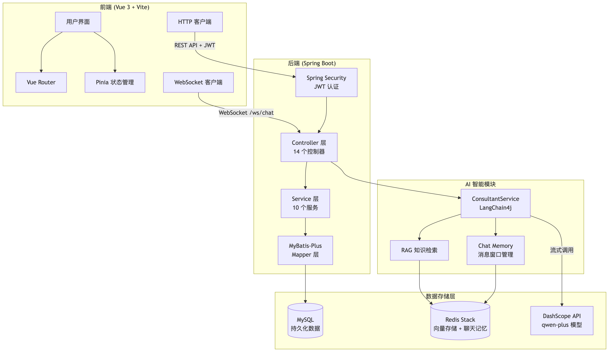

#### 安全认证架构设计
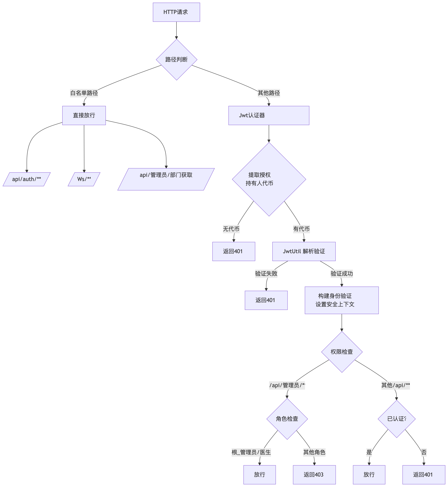

#### 前端路由守卫流程
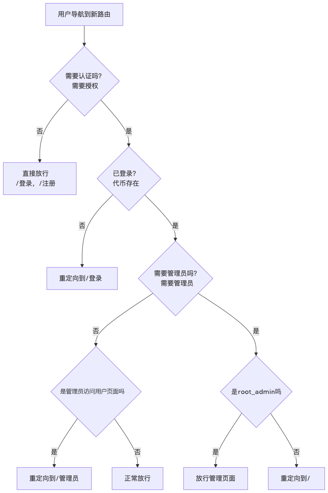

</details>

<details>
<summary><b>🩺 核心业务流程</b></summary>

#### AI 问诊核心流程
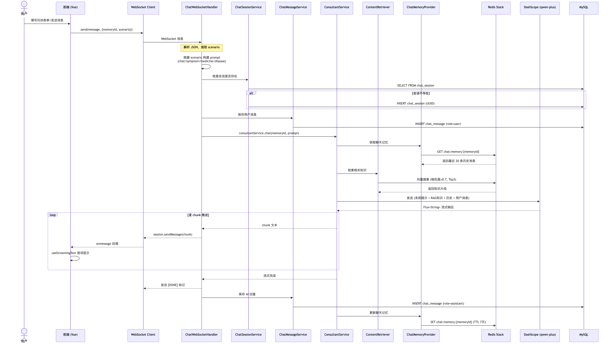

#### 症状自查流程
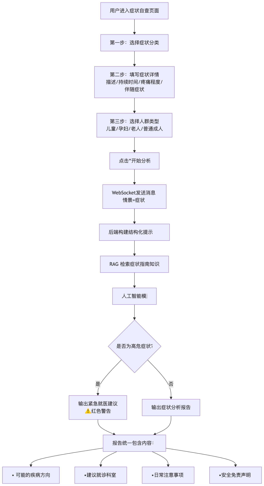

#### 用药咨询流程
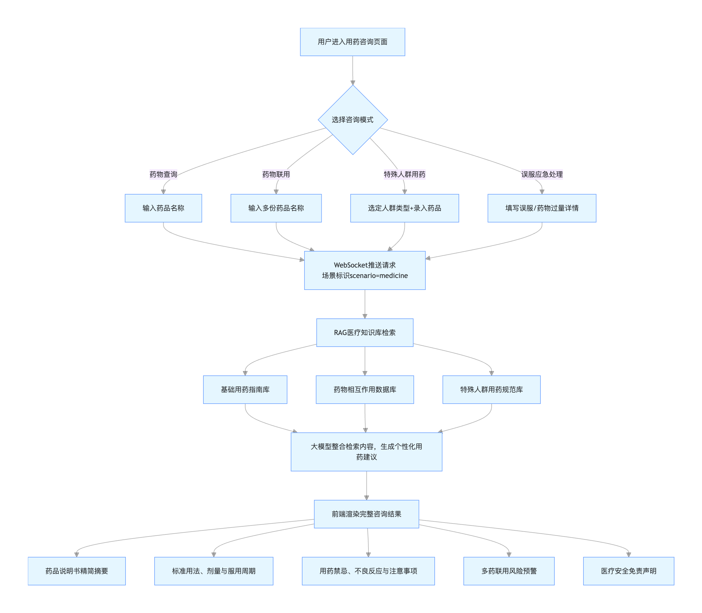

#### 预约挂号流程
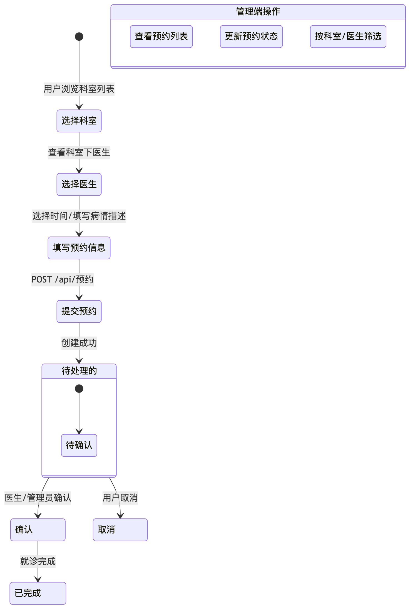

#### 社区问诊流程
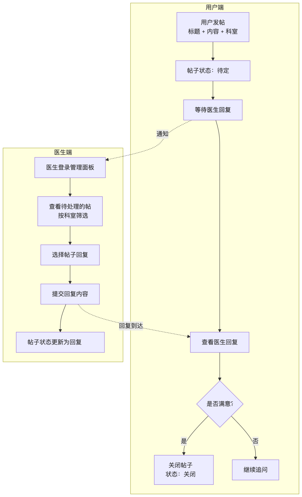

#### 健康档案管理流程
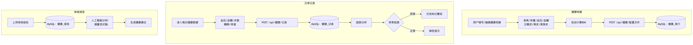

#### 管理后台功能流程
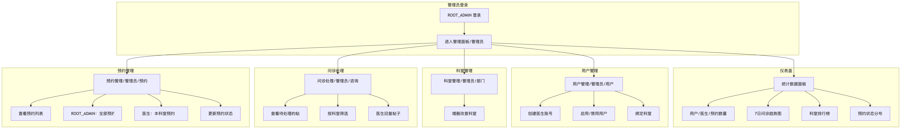

</details>

<details>
<summary><b>🗄️ AI 与数据架构</b></summary>

#### RAG 知识库构建流程
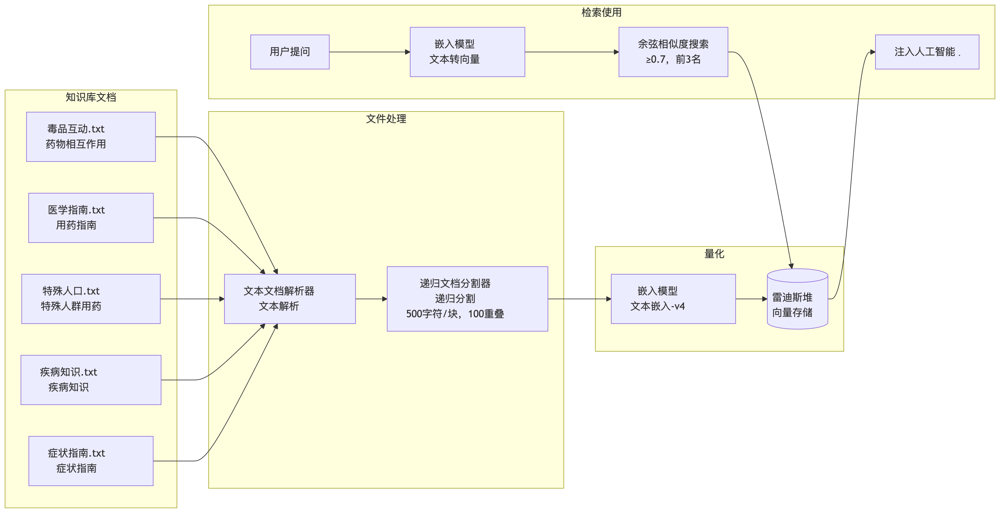

#### 数据库 ER 关系图（中文）


#### 数据库 ER 关系图（英文）
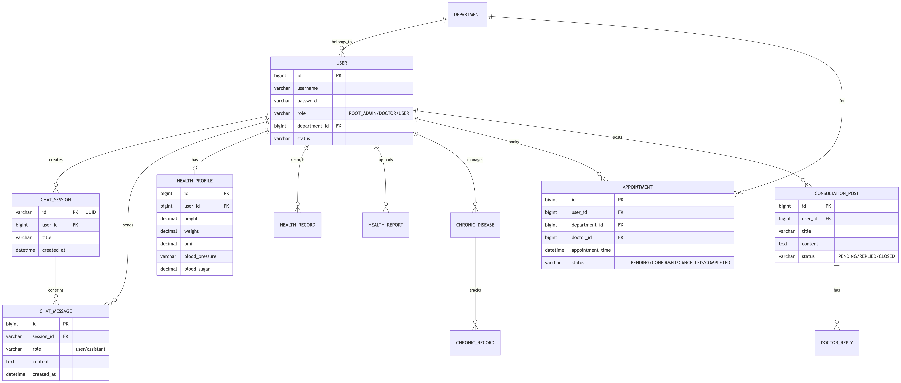

</details>

## 常见问题

### Q: 启动时报 Redis 连接错误？

确保使用的是 **Redis Stack** 而非普通 Redis。普通 Redis 不支持向量搜索模块（RediSearch）。

```bash
# 检查 Redis 是否支持向量搜索
redis-cli MODULE LIST
# 应该能看到 RediSearch 模块
```

### Q: AI 回复无响应或报错？

1. 检查 `application.yml` 中的 `api-key` 是否正确
2. 确认 API Key 对应的服务已开通且有额度
3. 查看后端日志中的请求/响应日志（已默认开启 `log-requests: true`）

### Q: 如何添加自定义 RAG 知识库？

将 `.txt` 文件放入 `major_ai/src/main/resources/content/` 目录，重启后端即可自动加载。文件会被分块（500 字符/块，100 字符重叠）并存入 Redis 向量库。

### Q: 前端请求 403 / CORS 错误？

后端已配置 CORS 允许 `localhost:5173`。如果前端部署到其他端口，需要修改后端 `SecurityConfig.java` 中的 CORS 配置。

## 许可证

MIT License
